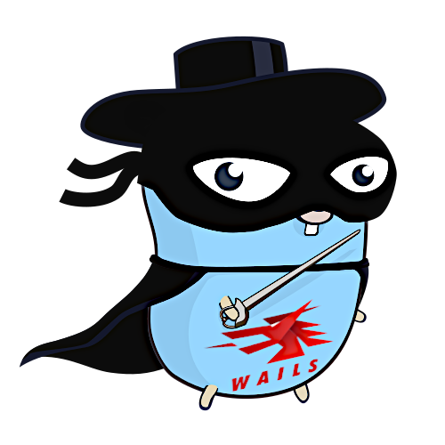
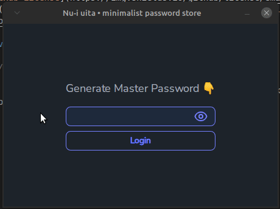

<div align="center">

# Nu-i uita

<p style="margin-bottom: 16px;">
    Minimalist password manager desktop app made with Golang-Wails & Svelte
</p>



<br />

  

</div>

<hr />

### Features 🚀

<div align="center" style="margin-bottom: 16px;">



<br />

<br />

</div>

- [x] **Using the [Wails](https://wails.io/) GUI framework:** `Wails` is a framework  that enables you to write desktop apps using Go and web technologies. This in itself allows you to immediately apply all your acquired knowledge if you come from the Web world, that's why we can consider it a lightweight and fast Electron alternative for Go. You can easily build applications with the flexibility and power of Go, combined with a rich, modern frontend. Wails supports cross-compilation for various platforms, native menus, dialogs and theming, use of various JavaScript frameworks for building the frontend, live development mode using the power of Vite, and a powerful CLI to easily create, build, and package applications, among many other [features](https://wails.io/docs/introduction#features).
- [x] **Using [`CloverDB`](https://github.com/ostafen/clover) as a database:** `CloverDB` is a lightweight, embedded NoSQL database, designed to be simple and easy to maintain, thanks to its small code base, which we have chosen for application data persistence. Although, perhaps, the main advantage of this DB is that it is written in pure Golang and that it has a simple and intuitive API. The fact that it is written in pure Golang (without any dependency on libraries in another language, such as `C` in the case of `SQLite`) allows you to avoid compiling with `CGO` enabled, which is useful when compiling for `Windows`. While `CloverDB` allows easy export/import to/from `JSON` files, we have chosen to export the data to a binary format that can only be read by the application itself.
- [x] **Using the [SevelteJS](https://svelte.dev/) frontend framework:** `Sevelte` is a UI framework to let you write breathtakingly concise components that do minimal work in the browser. It is the framework mainly recommended for the creation of GUIs by the creators of `Wails` given its ease of use, mainly in combination with `TypeScript`. Although the Wails CLI installs `Svelte3` by default, we have chosen to use `Svelte5` here, which allows the use of either the `runes` feature or the legacy system.
- [x] **Using the [svelte-spa-router](https://github.com/ItalyPaleAle/svelte-spa-router) library:** although the official Svelte routing library is `SvelteKit` it is a bit overkill for the purposes of a desktop application that only aims to swap different views in response to user interaction. Instead we have used (see [here](https://svelte.dev/docs/svelte/faq#Is-there-a-router)) the popular `svelte-spa-router` library which is insanely simple to use, and has a minimal footprint.
- [x] **Using the [svelte-i18n](https://github.com/kaisermann/svelte-i18n) library:** svelte-i18n helps you localize your application using the reactive tools offered by `Svelte`. This library simplifies translation management using JSON files that help your application easily switch between different languages. In fact, the use of the `Wails` framework, which uses web interfaces, greatly facilitates some common tasks in desktop applications, such as their translation. Some online tools can help you with the translation of `JSON` files, such as [`Translate i18next JSON resources/files`](https://translate.i18next.com/).
- [x] **Using the [sweetalert2](https://sweetalert2.github.io/) library:** As the documentation for this library says "a beautiful, responsive, customizable and accessible (WAI-ARIA) replacement for JavaScript popups with zero dependencies". Here we basically use it to create modals/dialog boxes easily and quickly. It is up to the user to decide whether the result makes the application "look excessively similar" to a website.🤦
- [x] **Using [`Tailwindcss`](https://tailwindcss.com/) and its plugin [`daisyUI`](https://daisyui.com/):** to allow you to style your application easily and quickly, and they also integrate seamlessly with `Svelte` and `Wails`.


<br />

---

### 👨‍🚀 Getting Started:

#### Installing the application

If you don't have Go, you can download the appropriate executable for your platform from [here](https://github.com/emarifer/Nu-i-uita/releases). Once unpacked, you can place it in the folder where your system normally stores executables (although you could place it in any directory). Then, you just need to update the system PATH with that address. For Linux, if you run the Makefile ("make user-install" to install to ~/.local/, or "make user-uninstall" to uninstall) you can easily install the application for the user or on the system ("sudo make install/uninstall").

If you already have Go installed (Go 1.20 or higher is required) and you want to modify code and/or build the binaries yourself, you will need to meet some prerequisites. You will need to consult the `Wails` documentation to install the dependencies required by your platform (see [here](https://wails.io/docs/gettingstarted/installation)). Obviously, for compiling and installing frontend dependencies you also need to have `NodeJs` installed which comes with the `npm` package manager (npm (Node 15+)).

`Wails` has the advantage of having a powerful [`CLI`](https://wails.io/docs/reference/cli/) that makes it very easy to generate the scaffolding to start an application, to develop with hot reload, and to build and package it into a single binary, in addition to the already mentioned cross-compilation for different platforms. So it is highly recommended to install it with the command:

```
$ go install github.com/wailsapp/wails/v2/cmd/wails@latest
```

>[!NOTE]
>***While the `wails init -n "myproject" -t svelte-ts` command scaffolds a new project using `Svelte3`, we've already mentioned that this application uses `Svelte5`. If you're interested in that option, as long as you have the `Wails CLI` and `NPM` installed, you can scaffold your projects using [this bash script](https://gist.github.com/emarifer/e98b2fd644db0cfdf465c9f76fc53c2f) I've created to automate that migration.***

From this point on, if you have met the above requirements, you can clone the repository and run the following command in the project folder to start the application in development mode:

```
$ wails dev
```

This allows hot reloading by saving modified code and monitoring the results, both in the launched application and in a browser (at the address `http://localhost:34115`). Right-clicking on the opened application window allows you to choose between several options, including opening a development tools panel equivalent to the devtools of the `Chrome` browser.

Finally, if you want to build the application executable by packaging everything, including the application icon and all assets (fonts, images, etc.) just run the command:

```
$ wails build
```

This will build the binary into the `build/bin` folder. However, for choosing other build options or performing cross-compiling, you may want to take a look at the Wails [CLI documentation](https://wails.io/docs/reference/cli/).

>[!NOTE]
>***As mentioned above I have created for the Linux version a compressed `.tar.xz` file with the application and a Makefile that acts as an 'installer' that installs the executable, a `desktop entry` to create an entry in the `Start Menu` and the corresponding application icon. For the Windows version, the binary is simply compressed as a `.zip` inside a folder called `dist/`. If you prefer, you can generate both compressed files by running the project's `Makefile`: "make create-bundles"***

---

### Happy coding 😀!!
